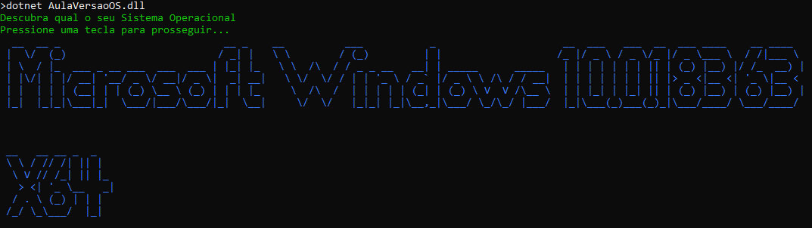

# AulaVersaoOS

Repositório para executar as orientações da aula

## Exemplo

```
Descubra qual o seu Sistema Operacional
Pressione uma tecla para prosseguir...
  __  __ _                           __ _    __          ___           _                     __  ___   ___  __  ___ ____    __ ____  
 |  \/  (_)                         / _| |   \ \        / (_)         | |                   /_ |/ _ \ / _ \/_ |/ _ \___ \  / /|___ \ 
 | \  / |_  ___ _ __ ___  ___  ___ | |_| |_   \ \  /\  / / _ _ __   __| | _____      _____   | | | | | | | || | (_) |__) |/ /_  __) |
 | |\/| | |/ __| '__/ _ \/ __|/ _ \|  _| __|   \ \/  \/ / | | '_ \ / _` |/ _ \ \ /\ / / __|  | | | | | | | || |> _ <|__ <| '_ \|__ < 
 | |  | | | (__| | | (_) \__ \ (_) | | | |_     \  /\  /  | | | | | (_| | (_) \ V  V /\__ \  | | |_| | |_| || | (_) |__) | (_) |__) |
 |_|  |_|_|\___|_|  \___/|___/\___/|_|  \__|     \/  \/   |_|_| |_|\__,_|\___/ \_/\_/ |___/  |_|\___(_)___(_)_|\___/____/ \___/____/ 


 __   __ __ _  _   
 \ \ / // /| || |  
  \ V // /_| || |_
   > <| '_ \__   _|
  / . \ (_) | | |
 /_/ \_\___/  |_|

 ```

 ## _Screenshot_

 

 ## _Download_

 Baixe o arquivo a seguir e o descompacte na página que desejar.

 [📥 Download do arquivo .rar](dist/VersaoOS.rar)

 ## Como executar

 ```

 dotnet AulaVersaoOS.dll
 ```
Caso esteja utilizando o Windows, basta dar um duplo clique em `VersaoOS.exe`.

## Agradecimentos

- [ETEC Adolpho Berezin](https://www.eteab.com.br)
- [Prof. Ermogenes Palacio](https://github.com/ermogenes)
- [Prof. Diego Neri](https://github.com/diegoneri)
- [Eu mesmo 😎](https://github.com/allan02machado)
- [Dev C#](https://github.com/ermogenes/aulas-programacao-csharp)
- [Figgle](https://github.com/drewnoakes/figgle)

---

PIRATARIA É CRIME!